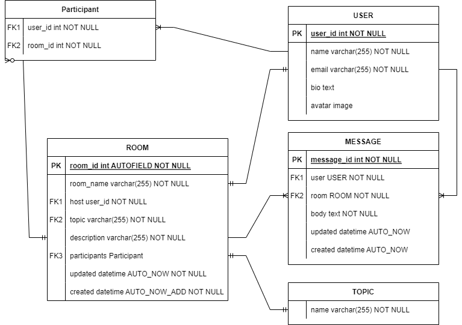

# Chat Room Project

Hoàng Thành Long
B20DCVT233

## Specification
- Language: Python
- Framework: Django -> Backend
- Frontend: HTML, CSS
- Database: SQLite
- Description: Chat Room
- Virtual environment: venv
- Requirements:
```python
asgiref==3.7.2
Django==4.2.5
django-cors-headers==4.2.0
django-filter==23.3
djangorestframework==3.14.0
Markdown==3.5.1
Pillow==10.0.1
pytz==2023.3.post1
sqlparse==0.4.4
tzdata==2023.3
```

## Database design
Relational diagram



## Features
- CRUD rooms, users, messages
- SuperUser and normal user
- Realtime messages
- Personalize user's profile
- Be able to interact with database through admin site
- Database from **model.py**